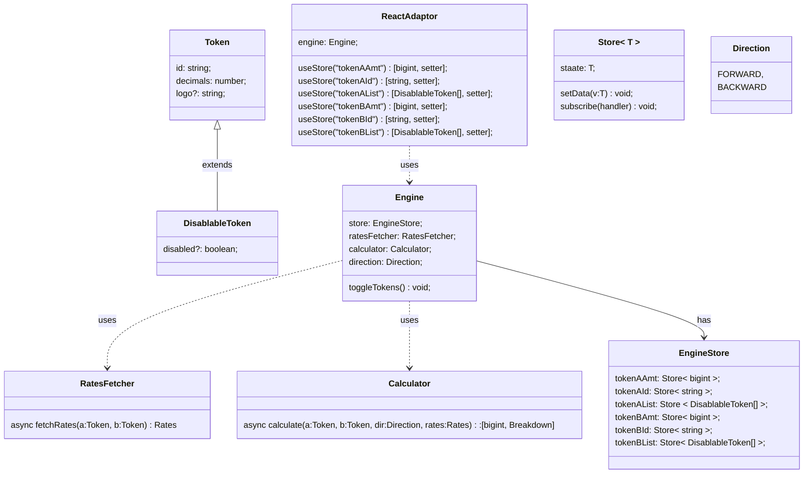

# fxgui

Universal gui widget framework for asset trading.

The widget is framework agnostic.

Bindings are provided for:

- React
- Solid
- vue

```ts
import { useFxGuiData } from "@blockhackers/fxgui-react";

type Token = {
  id: string;
  decimals: number;
  logo?: string;
};

type Disablable<T> = T & {
  disabled?: boolean;
};

const assets: Token[] = [
  { id: "ETH", decimals: 8 },
  { id: "BTC", decimals: 8 },
  { id: "USDC", decimals: 2 },
  { id: "JPY", decimals: 0 },
];

const assetLib = createAssetLib(assets);

assetLib.getAssetById:(id:string) => Asset
assetLib.formatAssetAmount(id:string,amount:bigint):string
assetLib.toDecimal(id:string, amount:bigint):Decimal;

useFxGui<TBreakdown extends object, TRates extends object>({
  assets,
  async calculate(
    tokenA: Token,
    tokenB: Token,
    tokenAAmt:bigint,
    tokenBAmt:bigint,
    direction: "ab" | "ba",
    rates: TRates
  ):Promise<[bigint, TBreakdown]>,
  async fetchRates(tokenA:Token, tokenB:Token):Promise<TRates>
}):{
  breakdown?:B
  tokenAAmt:bigint,
  tokenBAmt:bigint,
  tokenAId:string,
  tokenBId:string,
  tokenAList: Disablable<Token>[],
  tokenBList: Disablable<Token>[],
  onTokenAAmountChanged:(value:bigint) => void,
  onTokenBAmountChanged:(value:bigint) => void,
  onTokenAAssetChanged:(asset:string) => void,
  onTokenBAssetChanged:(asset:string) => void,
  onToggleTokens:() => void,
  error: string,
  isError:boolean,
  isFetchingVars:boolean,
  isFetchedVars:boolean,
  isLoading: boolean,
  isSuccess:boolean,
};
```

Some class holds the stores.

You can get all the stores with the react adaptor that accepts the state class and exposes useFxguiData to the rest of React.

```ts
import { Store } from "@tanstack/store";

const store = new Store(1234n);

store.setSate((old) => old + 2n);
expect(store.state).toBe(1236n);
```


